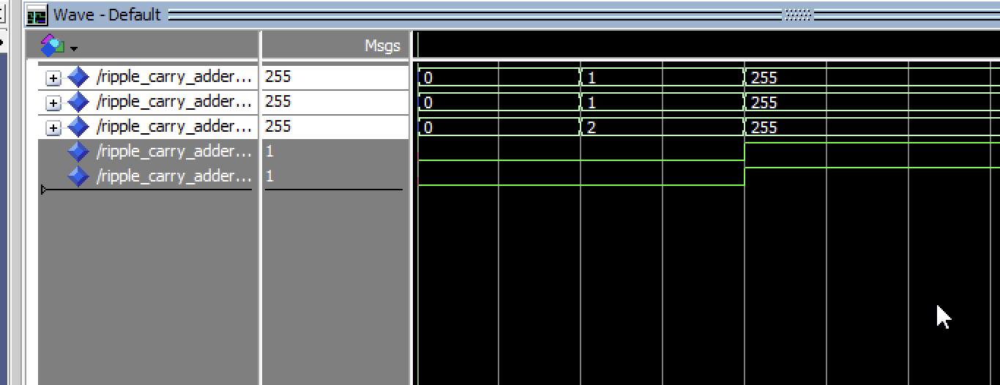

# ycbcr_proyect

## Tested

### Ripple Carry Adder

## Next tasks

-   Test the 24 bit ripple_carry_adder
-   Add a adder to the multiplier
-   Add sign logic to the multiplier
-   try the most basic version with the the multiplier and the adder and then try other types of block to try to find a more optimal design
-   Uniform the naming of variables and files

-   ASK: how to convert the coefficients to csd number
